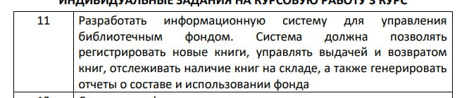

# Задание для курсовой работы

### Система должна позволять:
- [x] Регистрировать новые книги
- [x] Управлять выдачей книг
- [x] Управлять возвратом книг
- [x] Отслеживать наличие книг
- [x] Генерировать отчеты о составе и использовании фонда

### Читатель
- [x] Логин
- [x] Взять книгу
- [x] Сдать книгу
- [x] Показать мои книги

### Библиотекарь
- [x] Логин
- [x] Создать отчет
- [x] Просмотреть список людей с книгами
- [x] Добавить новые книги
- [x] Изменить статус книг

### Администратор
- [x] Добавить пользователя
- [x] Удалить пользователя
- [x] Редактировать пользователя
